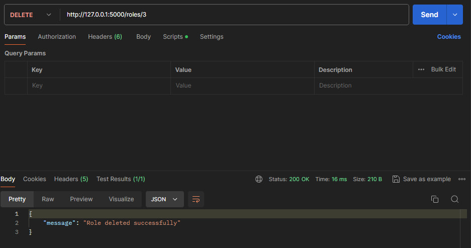

# Тестування працездатності системи

## Запуск сервера

## GET

### GET Role

## POST

### Перед POST

### POST

### Після POST

## UPDATE

### Перед UPDATE

### UPDATE

### Після UPDATE

## DELETE

### Перед DELETE

### DELETE

### Після DELETE

